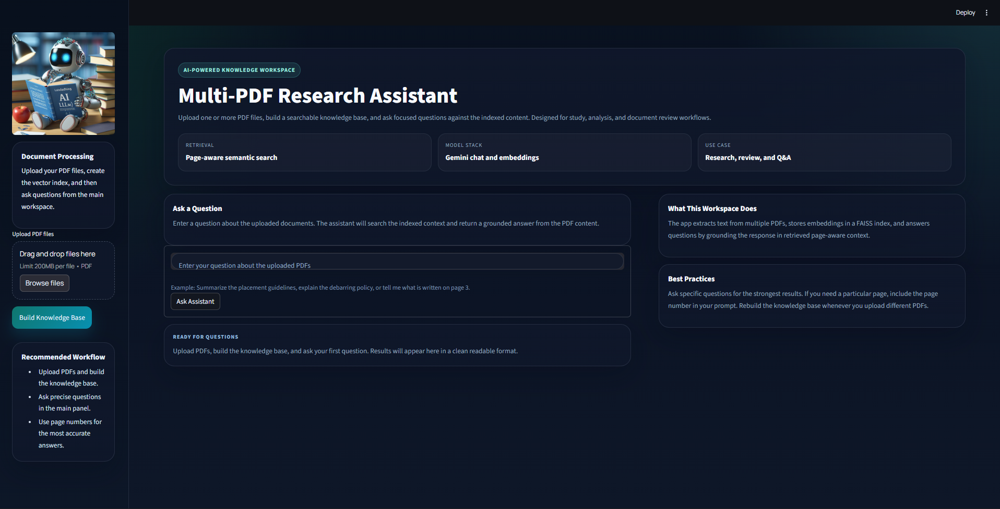

# Multi-PDF Research Assistant

A Streamlit app for asking questions across one or more PDF documents using Gemini embeddings, FAISS retrieval, and a local keyword fallback when Gemini is unavailable.



## What It Does

- Upload multiple PDF files.
- Extract page text and build a searchable knowledge base.
- Answer questions grounded in the indexed document content.
- Fall back to local keyword retrieval if Gemini or the network is unavailable.

## Project Structure

```text
Multi-PDFs_ChatApp_AI-Agent-main/
|-- app.py
|-- multipdf_chat/
|   |-- __init__.py
|   |-- app.py
|   |-- config.py
|   |-- knowledge_base.py
|   |-- qa.py
|   |-- styles.py
|   |-- text_utils.py
|   `-- ui.py
|-- assets/
|   `-- images/
|       |-- Robot.jpg
|       |-- app-preview.png
|       `-- chat-preview.png
|-- tests/
|   `-- test_text_utils.py
|-- LICENSE
`-- requirements.txt
```

## Requirements

- Python 3.10+
- A valid `GOOGLE_API_KEY` for Gemini-powered semantic search

Install dependencies with:

```bash
pip install -r requirements.txt
```

## Environment Setup

Create a `.env` file in the project root:

```env
GOOGLE_API_KEY=your-api-key-here
```

Optional overrides:

```env
GOOGLE_MODEL=gemini-2.5-flash
GOOGLE_EMBEDDING_MODEL=models/gemini-embedding-001
```

## Run the App

Preferred entry point:

```bash
streamlit run app.py
```

## How It Works

1. PDFs are uploaded through the Streamlit sidebar.
2. Text is extracted page by page.
3. The text is chunked and embedded with Gemini when available.
4. FAISS is used for semantic retrieval.
5. If Gemini is unavailable, the app falls back to local keyword-based matching.
6. Answers are generated from the retrieved context and shown in the main workspace.

## Notes

- The repository intentionally excludes sample PDFs to keep the project clean and lightweight.
- Generated FAISS artifacts are stored locally in `faiss_index/` and ignored by git.
- Preview images live in `assets/images/`.

## License

Distributed under the MIT License. See `LICENSE` for details.
